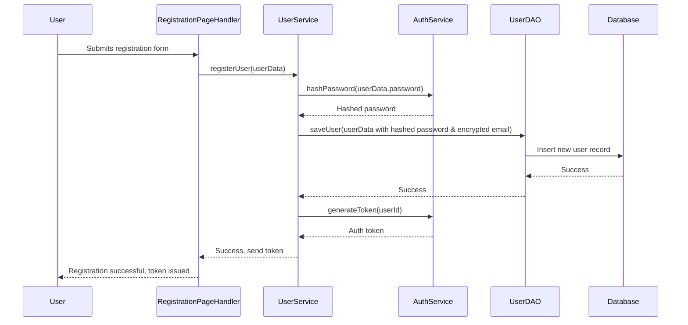
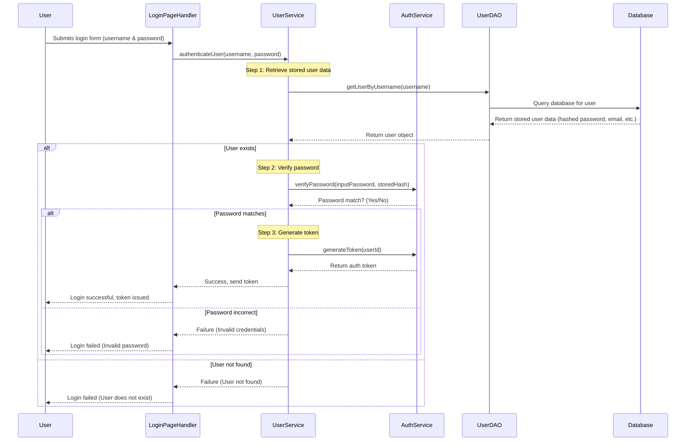

# Chirpy 1.0 – High-Level Design Document

## Overview

Chirpy is a microblogging service that allows users to register, post short messages (chirps), and interact through a timeline.
This document outlines the core functionalities, data access objects (DAO), business logic layer (BLL), and data storage strategy for Chirpy 2.0.

## Features

### User Management

* **User Registration:** Users can register with a unique username and password.  
* **User Authentication:** Users log in with their credentials.  
* **User Sessions:** Maintain session state via cookies.

### Chirping

* **Post Chirps:** Users can create and submit chirps.  
* **Search Chirps:** Users can search by username or hashtag.  
* **View Timeline:** Users see a timeline of chirps from followed accounts.

### Following
* **Follow User:** Users can follow other users
* **View Followers:** Users can view who follows themself
* **View Following:** Users can view all the accounts they follow

### Timelines

* **Discover:** Users can see a timeline of chirps from all existing accounts
* **Following:** Users see a timeline of chirps from followed accounts.

### Searching

* **By Chirper:** Users can search a Chirper's handle (e.g `@AdrianF`) to see all Chirps made by that Chirper
* **By tag:** Users can search a hashtag (e.g `#YourChirpyGroups`) to see all Chirps containing that tag

### Navigation

* **Links:** Users can navigate via links to key pages (register, login, timeline, search, debugging pages).
* **Hashtags:** Users can search for a hashtag and display all posts with that hashtag

## Entities (Models)

### Chirper (User)
---
A class representing a user in the system.

#### Chirper(String username, String password)
Creates a new user (chirper).
- **username:** the username of the user
- **password:** the user's hashed password

#### String getUsername()
Retrieves the user's current username
- **returns** the string stored in the username property

#### void setPassword(String password)
sets a new password
- **username:** the new password of the user

#### String getPassword()
retrieves the user's password
- **returns** the string stored in the password property

### Chirp (Post)
---
A container to store post data

#### Chirp(String authorID, String textContent,)
Initiates a new chirp
- **authorID:** the id of the user who created the post
- **textContent:** the message of the post

#### String getOwnerUsername()
- **returns** the authorID property

#### String getContent()
- **returns** the textContent property

#### LocalDateTime getTimeStamp()
- **returns** the raw timestamp from the creation of the Chirp

#### String getFormattedTime()
- **returns** the formated timestamp of the Chirp

### Follow
Represents a relationship between two Chirpers, where one user follows another.

#### Follow(String follower, String followee)
Creates a new Follow object
- **param follower:** the username of the user who is following
- **param followee:** the username of the user being followed

#### String getFollower()
- **returns** the username of the follower

#### String getFollowee()
- **returns** the username of the followee

## Followers/Following Relationship

| This Person | Follows This Person |
|-------------|---------------------|
| Adam        | Bob                 |
| Adam        | Charlie             |
| Adam        | David               |
| Bob         | Adam                |
| Bob         | Charlie             |
| Charlie     | Adam                |
| Charlie     | Bob                 |
| David       | Adam                |
| David       | Bob                 |
| Is followed by this person | This person |

- User can follow another user, can be followed by other users
- Users can see lists of their followers/following
- Users can see a timeline of all Chirpy users, or just the users they follow

## Data Access Objects (DAO)

DAO classes handle data persistence. Initially, data is stored in-memory using hash maps and vectors.
- Directly interacts with the database (CRUD operations).
- Returns raw objects (doesn’t apply business logic).

### ChirperDao  
---
The ChirperDao is responsible for managing the persistence of Chirper objects in the database. It provides an abstraction layer for CRUD operations related to Chirpers (users), ensuring that the underlying data storage mechanisms remain hidden from the rest of the application. Responsibilities include:

- **Data Persistence:** Handles the saving, retrieving, updating, and deleting of Chirper objects from the database.
- **Encapsulation:** Instantiates and manipulates Chirper objects internally, ensuring that business logic or other layers do not directly interact with raw Chirper instances.
- **Database Interactions:** All database-related operations (e.g., queries, updates, inserts) are performed within the DAO, abstracting away any database details from other parts of the application.

By keeping all database operations encapsulated within the DAO, ChirperDao ensures that other layers, such as the business logic (ChirperService), are not dependent on the internal structure of the Chirper objects. The DAO interacts with Chirper instances solely by their identifiers (e.g., username), making it independent and protecting the integrity of the data.

#### ChirperDAO(Serializer\<Chirper\> chirpSerializer)
Initializes the DAO with a given serializer  
- **chirpSerializer:** serializer used to persist and load Chirper objects  

#### void loadChirpers()
Loads Chirper objects from persistent storage into memory  

#### boolean chirperExists(String username)
- **returns** true if the Chirper exists in memory  

#### boolean passwordMatches(String username, String plaintext_password)
- **returns** true if the provided password matches the stored password  

#### boolean setChirperPassword(String username, String plaintext_password)
- **returns** true if the password was successfully updated  

#### String getChirperPassword(String username)
- **returns** the stored password (for debugging) or null if user not found  

#### boolean getChirperPublicStatus(String username)
- **returns** the public status of the Chirper  

#### boolean setChirperPublicStatus(String username, boolean status)
- **returns** true if the public status was successfully updated  

#### boolean addChirper(String username, String plaintext_password, boolean publicChirps)
Adds a new Chirper and persists it  
- **returns** true if the Chirper was successfully added  

#### String hashPassword(String plaintext_password)
- **returns** a hashed version of the provided password (currently no-op)  

#### boolean deleteChirper(String username)
- **returns** false (method not implemented yet)  

#### Set\<String\> keySet()
- **returns** a set of all registered Chirper usernames  

### ChirpDao
---
Manages Chirp posts. Provides methods to add, retrieve, and load chirps from persistent storage.

#### ChirpDAO(Serializer\<Chirp\> chirpSerializer)
Initializes the DAO with a given serializer  
- **chirpSerializer:** serializer used to persist and load Chirp objects  

#### void loadChirps()
Loads all chirps from persistent storage and stores them by user  

#### void addChirp(String username, String content)
Creates a new Chirp and adds it to the user's history  
- **username:** the user who created the chirp  
- **content:** the text content of the chirp  

#### Vector\<Chirp\> getChirpsByUser(String username)
- **param username** the username of the specified user
- **returns** all chirps authored by the specified user  

#### Vector\<Chirp\> getAllChirps()
- **returns** all chirps from all users  

## FollowDao
---
Responsible for managing Follow relationship objects

### FollowDAO
---
Manages follow relationships between users. Provides methods to add, retrieve, and delete follow relationships.

#### FollowDAO(Serializer\<Follow\> followSerializer)
Initializes the DAO with a given serializer  
- **followSerializer:** serializer used to persist and load Follow objects  

#### boolean loadFollows()
Loads all follow relationships from persistent storage and stores them in adjacency lists  
- **return** true if follows are loaded successfully

#### Vector\<String\> getAccountsFollowingUser(String username)
- **param username** the username of the specified user
- **returns** a vector containing the usernames of all followers of the specified user  
- **note** returns a copy of the followers list to prevent external modification  

#### Vector\<String\> getAccountsUserFollows(String username)
- **param username** the username of the specified user
- **returns** a vector of usernames of all users followed by the specified user  
- **note** returns a copy of the followees list to prevent external modification  

#### String generateFilename(String followerUsername, String followeeUsername)
Generates a filename for a follow relationship using the usernames of the follower and followee  
- **followerUsername:** the username of the follower  
- **followeeUsername:** the username of the followee  

#### boolean createRelationship(String followerUsername, String followeeUsername)
Creates a new follow relationship between two users and persists it  
- **followerUsername:** username of the follower  
- **followeeUsername:** username of the followee  
- **returns** true if the relationship is created successfully, false otherwise  

#### boolean deleteRelationship(String followerUsername, String followeeUsername)
Deletes a follow relationship between two users and removes it from persistent storage  
- **followerUsername:** username of the follower  
- **followeeUsername:** username of the followee  
- **returns** true if the relationship is deleted successfully, false otherwise  

## Business Logic Layer (BLL)

- Enforces app rules (e.g., max chirp length, permission checks).
- Calls DAO to fetch/store data and applies business logic.

### UserService
---
The UserService class is part of the business logic layer and serves as the intermediary between the page handlers (or controllers) and the data access objects (DAOs). It is responsible for:
- Managing user-related business logic
- Interacting with the UserDao for database operations
- Utilizing AuthService for authentication and security
- Ensuring data validation before passing to the DAO

#### UserService(ChirperDao chirperDao)
Creates a new UserService instance with the provided ChirperDao.

#### public boolean registerUser(String username, String password) throws UsernameIsTaken
Handles user registration by validating input and saving the user in the database.
- Validates the username and password
- Checks if the username already exists using UserDao
- Saves the user to the database via UserDao
- **username:** The string username of the user to register.
- **password:** The user-provided password to hash and store.
- **throws UsernameIsTaken** if the username is already taken.
- **returns** `true` if the user was successfully registered, otherwise `false`.

#### public boolean isValidUser(String username, String password)
Verifies login credentials by checking username and password.
- **returns** `true` if authentication succeeds, otherwise `false`.

#### public boolean usernameExists(String username)
Verifies that a user exists with that username.
- **username** The username to be verified.
- **returns** `true` if the username is registered in the users data structure, otherwise `false`.

#### public Vector<String> getUsernames()
Shallow copies of all usernames.
- **returns** A vector containing the usernames of all of the registered users.

#### public Vector<Chirper> getUsers()
Shallow copies of all stored users' `Chirper` objects.
- **returns** A vector containing shallow copies of all stored `Chirper` objects.

#### public boolean isLoggedIn(HttpExchange exchange)
Checks if the user is logged in by verifying the "username" cookie.
- **exchange:** The HttpExchange object containing the request and response details.
- **returns** `true` if the "username" cookie exists and corresponds to a valid username, `false` otherwise. If the cookie is invalid, it will be deleted.

#### Inner exception classes
* `UsernameIsTaken extends IllegalArgumentException`
* `UserDoesNotExist extends IllegalArgumentException`
* `IncorrectPassword extends IllegalArgumentException`

### ChirpService
---
Responsible for managing chirps. It provides methods to post a chirp, retrieve chirps by a specific user, and retrieve all chirps.

#### ChirpService(ChirpDAO chirpDAO)
Creates a new ChirpService instance with the provided ChirpDAO.

#### public void postChirp(String username, String content)
Posts a chirp for a specific user.
- **username:** The username of the user posting the chirp.
- **content:** The content of the chirp.
- **returns** void.

#### public Vector<Chirp> getChirpsByUser(String username)
Retrieves all chirps posted by a specific user.
- **username:** The username of the user whose chirps are to be retrieved.
- **returns** A vector containing all chirps posted by the user.

#### public Vector<Chirp> getAllChirps()
Retrieves all chirps from the database.
- **returns** A vector containing all chirps from the database.

### FollowService
---
Responsible for managing "following" relationships between users in a social media application. It provides methods to follow and unfollow users, retrieve lists of followers and followees, and check if a user is following another user.

#### FollowService(FollowDAO followDAO)
Creates a new FollowService instance with the provided FollowDAO.

#### public void follow(String followingUser, String targetUser)
Adds the following relationship between two users.
- **followingUser:** The username of the user who is following.
- **targetUser:** The username of the user being followed.
- **throws** IllegalArgumentException if the user tries to follow themselves.
- **throws** IllegalStateException if the user is already following the target user.

#### public void unfollow(String followingUser, String targetUser)
Deletes the following relationship between two users.
- **followingUser:** The username of the user who follows.
- **targetUser:** The username of the user being unfollowed.
- **throws** IllegalArgumentException if the user tries to unfollow themselves.
- **throws** IllegalStateException if the user is not following the target user.

#### public boolean isFollowing(String followingUser, String followedUser)
Checks if a user is following another user.
- **followingUser:** The username of the user who might be following.
- **followedUser:** The username of the user who might be followed.
- **returns** `true` if the `followingUser` is following the `followedUser`, `false` otherwise.

#### public Vector<String> getAccountsUserFollows(String username)
Returns a vector of the usernames of Chirpers the follower follows.
- **username:** The username of the Chirper who is following others.
- **returns** A vector of usernames that the follower follows.

#### public Vector<String> getAccountsFollowingUser(String username)
Returns a vector of the usernames of Chirpers who follow the specified user.
- **username:** The username of the Chirper being followed.
- **returns** A vector of usernames that follow the given user.

### SearchService
---
A service to handle searching for chirps based on tags or the username of the Chirper.

#### SearchService(ChirpService cs)
Initializes a new SearchService with the provided ChirpService.
- **cs:** A reference to the ChirpService object used to retrieve chirps.

#### public Vector<Chirp> searchByTag(String tag)
Searches for chirps that contain a specific tag.
- **tag:** The tag to search for.
- **returns:** A list of `Chirp` objects that contain the specified tag in their content.

#### public Vector<Chirp> searchByUser(String username)
Searches for chirps made by a specific Chirper.
- **username:** The username of the Chirper whose chirps are to be searched.
- **returns:** A list of `Chirp` objects made by the specified user.

## Data Storage

Data is stored both in memory, and persistently as serialized files on the server

### Chirper
* **Memory:** in a \`HashMap\<String, Chirper\>\` (username → user data)  
* **Storage:** as a serialized Vector of Chirper objects

### Chirps
* **Memory:** Stored in a \`List\<Chirp\>\` where \`Chirp\` is a class containing \`username\` and \`message\`.
* * **Storage:** as a serialized Vector of Chirp objects

### Follow Relationships
* **Memory:** as a Vector and double adjacency list: \`Vector\<FollowRelationship\>\`, \`HashMap\<String, List\<String\>\>\` (user → followers), \`HashMap\<String, List\<String\>\>\` (user → followees)
* **Storage:** as a serialized Vector of FollowRelationship objects

## State persistence

The domain classes, which contain the information about User, Chirp, follow, and like states, are stored in memory. These are interacted with only via the data access classes (DAO classes), which ensure that the state of all of these objects is backed up in secondary storage. This is done in the form of `.ser` files. Every time a state object is created or updated, its corresponding DAO object serializes the object and stores it as a file within the `data/` directory. When the server shuts down and starts back up, then upon construction the DAO classes will iterate through the `.ser` files within the `data/` directory, deserialize them, and store them in primary memory. 

The `Serializer` class plays a central role in making this state persistence possible. It provides a generic mechanism for serializing and deserializing objects of any class that implements the `Serializable` interface. The `Serializer` class handles the creation, reading, updating, and deletion (CRUD) of serialized objects. It stores these objects as `.ser` files in a specified directory. When the server is restarted, the `Serializer` class ensures that all objects can be loaded from their respective files back into memory, preserving their state across server restarts. It also ensures type safety and handles file and directory management automatically, making it a reliable utility for persistent storage of domain objects.

### Serializer
---
Responsible for serializing and deserializing objects that implement the `Serializable` interface. It provides methods for basic CRUD operations, including creating, reading, updating, deleting, and loading serialized objects from a specified directory.

#### Serializer(Class<T> classType, String targetDirectory)
Creates a new Serializer instance with the provided class type and target directory.
- **classType:** The class type of the objects to be serialized. Must implement `Serializable`.
- **targetDirectory:** The directory where the serialized objects will be stored.
- **throws** `NonSerializableClassException` if the provided class does not implement `Serializable`.
- **throws** `IOException` if an error occurs while creating the directory.

#### public void createState(T object, String fileName)
Serializes the given object and saves it to a file with the specified name.
- **object:** The object to be serialized and saved.
- **fileName:** The name of the file (without extension) where the serialized object will be stored.
- **throws** `FileAlreadyExistsException` if a file with the specified name already exists.
- **throws** `IOException` if an I/O error occurs during the creation or writing of the file.

#### public T readFile(String fileName)
Reads and deserializes an object of type `T` from the file with the specified name.
- **fileName:** The name of the file (without extension) to read the object from.
- **returns** The deserialized object of type `T`.
- **throws** `NoSuchFileException` if the file does not exist.
- **throws** `ObjectTypeMismatchException` if the object type in the file does not match the expected type.
- **throws** `IOException` if an I/O error occurs while reading the file.
- **throws** `ClassNotFoundException` if the class of the serialized object cannot be found.

#### public void updateState(T object, String fileName)
Updates the state of the specified object by serializing it and writing it to a file with the given file name.
- **object:** The object to be serialized and written to the file.
- **fileName:** The name of the file (without extension) where the object will be stored.
- **throws** `NoSuchFileException` if the file does not exist in the directory.
- **throws** `IOException` if an I/O error occurs during the update process.

#### public void deleteState(String fileName)
Deletes the serialized state file with the specified name from the directory.
- **fileName:** The name of the file (without the ".ser" extension) to be deleted.
- **throws** `NoSuchFileException` if the file does not exist in the directory.
- **throws** `IOException` if an I/O error occurs while attempting to delete the file.
- **throws** `SecurityException` if the deletion is denied due to insufficient permissions.

#### public Vector<T> loadDirectory()
Loads and deserializes all objects from the specified directory.
- **returns** A `Vector` containing all successfully deserialized objects from the directory. If no objects are successfully deserialized or the directory cannot be read, an empty `Vector` is returned.
- **throws** `IOException` if an I/O error occurs while reading the directory.

### Exceptions

#### NonSerializableClassException
Thrown when the specified class does not implement `Serializable`.
- **constructor:** `public NonSerializableClassException(String message)`

#### ObjectTypeMismatchException
Thrown when a deserialized object does not match the expected type.
- **constructor:** `public ObjectTypeMismatchException(String message)`

## Libraries (Need to be approved by Essick for use in Chirpy 2.0)

* [Java JWT](https://github.com/jwtk/jjwt) for creating and verifying JSON Web Tokens
* [jBCrypt](https://github.com/jeremyh/jBCrypt) for password hashing

## Diagrams (Unfinished, but not required in rubric)

### User Registration Flow

### User Authentication Flow

